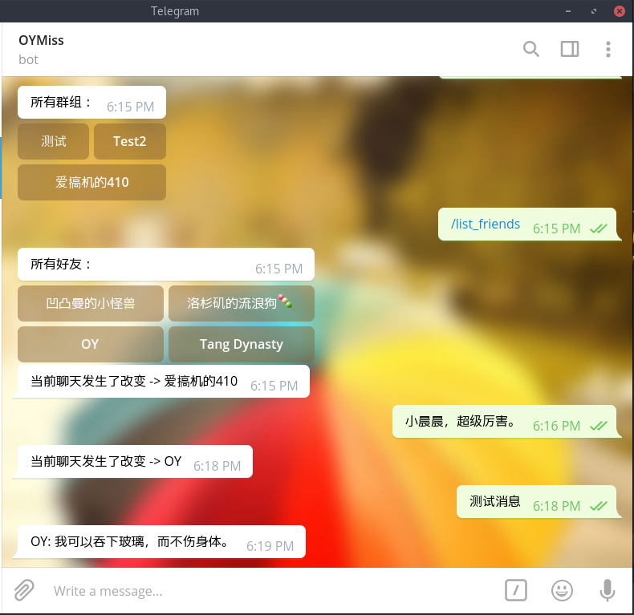
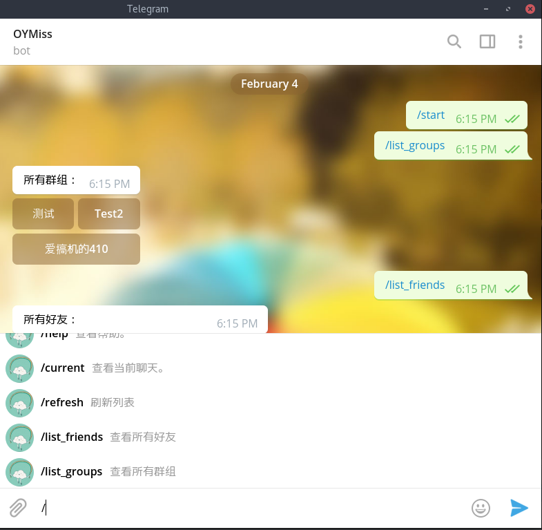

# forward-bot

用 `telegram` 去和你的`QQ` 好友聊天。

使用的开源仓库有：
[cqhttp-python-sdk](https://github.com/richardchien/cqhttp-python-sdk),
[coolq-http-api](https://github.com/richardchien/coolq-http-api),
[python-telegram-bot](https://github.com/python-telegram-bot/python-telegram-bot)

## 效果图





## 使用步骤
### 1. 先要获取到你的Telegram 账号的ID（数字，类似于QQ号码).

去找 `@oy_test_bot` 这个机器人然后 输入命令 `get_my_id`。

然后`保存`好这个数字。

### 2. 去找 `@BotFather` 注册一个机器人。

`保存`好你的机器人的 `TOKEN`。

为了方便增加一些指令。(Edit Bot -> Edit Commands)

```
help - 查看帮助。
current - 查看当前聊天。
refresh - 刷新列表
list_friends - 查看所有好友
list_groups - 查看所有群组
```

### 3. 使用Docker 创建服务端

首先要安装好 Docker [链接](https://docs.docker.com/install/) 安装 `docker-ce`。

安装好之后。

```
$ docker pull richardchien/cqhttp:latest
$ mkdir coolq  # 用于存储酷 Q 的程序文件
```

为了安全，修改 VNC_PASSWD, CQHTTP_ACCESS_TOKEN, CQHTTP_SECRET 这三项的内容。

```
$ sudo docker run -d --network=host -ti --rm --name cqhttp-test \
            -v $(pwd)/coolq:/home/user/coolq \
            -p 9000:9000 \
            -p 5700:5700 \
            -e VNC_PASSWD=fK32lrGf \
            -e CQHTTP_POST_URL=http://localhost:8889 \
            -e CQHTTP_HOST=127.0.0.1 \
            -e CQHTTP_SERVE_DATA_FILES=yes \
            -e CQHTTP_SECRET=kP9yK2lrGxoymmpo \
            -e CQHTTP_ACCESS_TOKEN=Mgep4rV49rM8Jf \
            richardchien/cqhttp:latest
```

然后使用 访问 `your_ip:9000`。如果是本地的话，就填`localhost`，远程就填公网 `ip`。
输入上面的 VNC_PASSWD 密码，登录QQ 号。登录之后，就可以把网页关掉。

### 4. 运行 forward-bot

安装依赖库。

```
$ pip3 install cqhttp
$ pip3 install python-telegram-bot
```

下载源代码

```
$ git clone https://github.com/OYMiss/forward-bot.git
$ cd forward-bot
```

将第1, 2步的信息保存在 `forward-bot/telegram_bot.config` 文件中。
如果使用代理 设置`IS_PROXY=TRUE`，否则 `FALSE`

注：代码中是：`socks5://127.0.0.1:1080/`，需要改的话，
直接改 `telegram_bot/telegram_bot.py` 第155行。

格式如下：

```
TG_TOKEN=531873229:AAENkkUWHYLhl982OS6HwRgZwZvokQzoBew
TG_ID=404348187
IS_PROXY=TRUE
```

需要修改`forward-bot/coolq_bot.config`。
对应的是 第3步中的 `CQHTTP_SECRET` 和 `CQHTTP_ACCESS_TOKEN`。

格式如下：

```
CQHTTP_SECRET=kP9yK2lrGxoymmpo
CQHTTP_ACCESS_TOKEN=Mgep4rV49rM8Jf
```

然后运行。

```
$ python3 main.py
```

然后在你的 Bot 上回复 `/list_friends` 点击一个人，开始聊天吧。


